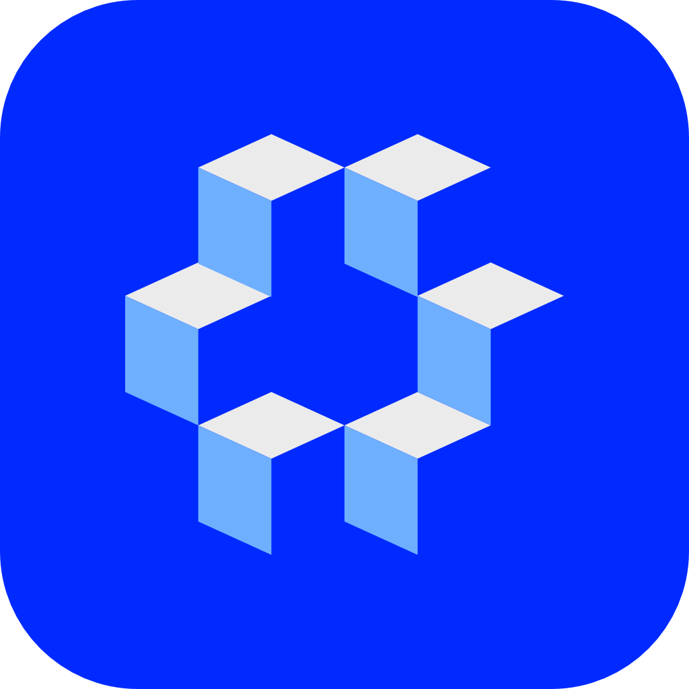

# Moseng Backpack

**EN** | [한국어](#한국어)

---

## English

A desktop asset browser for 3D artists — browse, tag, and send PBR materials and textures directly into your DCC tool.

Built with Python + PySide6. Integrates with **Backpack for Houdini** to send materials straight into a Redshift network.



---

### Features

- **Asset Browser** — grid / list view with live thumbnail generation
- **Folder Tree** — navigate your local texture library with collapsible folders
- **Tag System** — color-coded tags with per-asset editing; filter by any combination
- **Detail Panel** — preview image, resolution, file size, map list, star rating, notes
- **Send to Houdini** — one-click material or single-texture transfer to a running Houdini session
  - `⬡ Build RS Material` — builds a full Redshift OpenPBR network in `/mat`
  - `→ Add to RS Builder` — drops a single `rsTexture_*` node into the active Material Builder
- **Downscale** — generate lower-resolution variants of any material on-the-fly
- **Import Dialog** — drag-and-drop or folder-scan to add new assets

---

### Requirements

```
Python 3.10+
PySide6
Pillow
```

Install dependencies:

```bash
pip install -r requirements.txt
```

---

### Getting Started

```bash
# Clone
git clone https://github.com/ansanclay/Moseng-Backpack.git
cd Moseng-Backpack

# Install dependencies
pip install -r requirements.txt

# Run
python -m backpack
# or
Backpack.bat   # Windows shortcut
```

---

### Houdini Integration

To send materials to Houdini, install **[Backpack for Houdini](https://github.com/ansanclay/Backpack-for-Houdini)** and start the server from its shelf.

The status dot in the detail panel turns **green** when a Houdini session is listening on `localhost:29700`.

---

### Project Structure

```
backpack/
  app.py                  # Application entry point
  constants.py            # Colors, tag palette
  core/
    scanner.py            # Folder scan, asset discovery
    metadata.py           # Per-asset JSON sidecar read/write
    tag_registry.py       # Global tag list
    preview.py            # Thumbnail generation
    downscale.py          # Resolution downscaling
    folder_model.py       # Qt folder tree model
  ui/
    main_window.py        # Main window layout
    asset_browser.py      # Grid/list browser + toolbar
    asset_detail.py       # Right-side detail panel
    folder_tree.py        # Left folder tree
    tag_bar.py            # Tag chip bar
    houdini_bridge.py     # TCP client → Backpack for Houdini
    theme.py              # Dark theme stylesheet
    delegates/
      thumbnail_delegate.py
    dialogs/
      import_dialog.py
      settings_dialog.py
      tag_picker.py
```

---

### License

MIT

---

---

## 한국어

3D 아티스트를 위한 데스크탑 에셋 브라우저 — PBR 머티리얼과 텍스처를 탐색하고, 태그를 달고, DCC 툴로 바로 전송합니다.

Python + PySide6로 제작되었으며, **Backpack for Houdini**와 연동하여 Redshift 머티리얼 네트워크로 직접 전송할 수 있습니다.

---

### 주요 기능

- **에셋 브라우저** — 그리드 / 리스트 뷰, 실시간 썸네일 생성
- **폴더 트리** — 로컬 텍스처 라이브러리를 접이식 폴더로 탐색
- **태그 시스템** — 컬러 태그, 에셋별 편집, 조합 필터링
- **디테일 패널** — 미리보기 이미지, 해상도, 파일 크기, 맵 목록, 별점, 노트
- **Houdini 전송** — 실행 중인 Houdini 세션으로 머티리얼 또는 단일 텍스처 전송
  - `⬡ Build RS Material` — `/mat`에 Redshift OpenPBR 네트워크 전체 빌드
  - `→ Add to RS Builder` — 활성화된 Material Builder에 `rsTexture_*` 노드 한 개 추가
- **다운스케일** — 머티리얼의 저해상도 버전 즉석 생성
- **임포트 다이얼로그** — 드래그 앤 드롭 또는 폴더 스캔으로 에셋 추가

---

### 요구 사항

```
Python 3.10+
PySide6
Pillow
```

의존성 설치:

```bash
pip install -r requirements.txt
```

---

### 시작하기

```bash
# 클론
git clone https://github.com/ansanclay/Moseng-Backpack.git
cd Moseng-Backpack

# 의존성 설치
pip install -r requirements.txt

# 실행
python -m backpack
# 또는
Backpack.bat   # Windows 바로가기
```

---

### Houdini 연동

Houdini로 머티리얼을 전송하려면 **[Backpack for Houdini](https://github.com/ansanclay/Backpack-for-Houdini)**를 설치하고 셸프에서 서버를 시작하세요.

디테일 패널의 상태 점이 **초록색**으로 바뀌면 `localhost:29700`에서 Houdini 세션이 수신 대기 중인 것입니다.

---

### 라이선스

MIT
