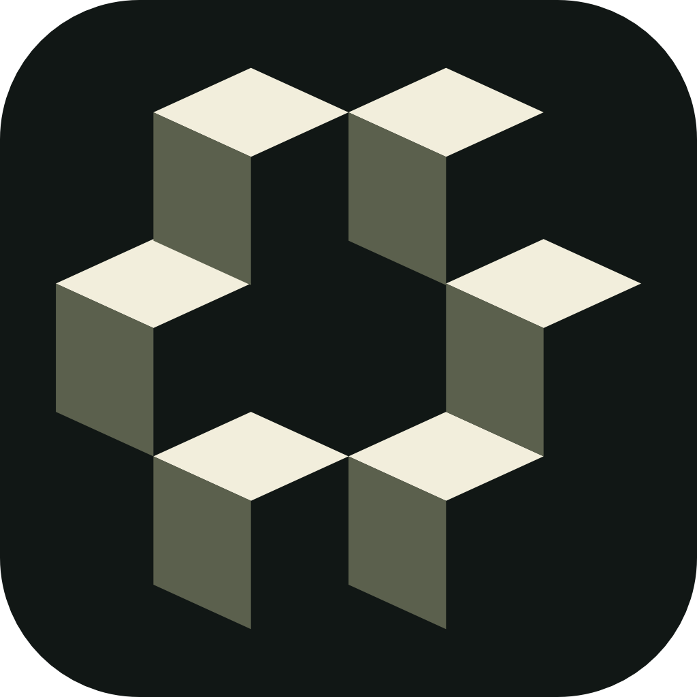

# Moseng Backpack

**EN** | [한국어](#한국어)

---

## English

A desktop asset browser for 3D artists — browse, tag, and send PBR materials and textures directly into your DCC tool.

Built with Python + PySide6. Integrates with **Backpack for Houdini** to send materials straight into a Redshift network.



---

### Features

- **Dockable panels** — a 3D-app-style shell (Houdini/Maya feel) built on Qt Advanced Docking. Drag panels to split, tab, or float as separate windows; reopen or duplicate any panel from the `＋` button; layouts persist between sessions
- **Asset Browser (Explorer)** — **grid** / **list** views plus a **compact** toggle; live thumbnail generation. List view shows file size + modified date, with subfolder items indented
- **Project panel** — point at a project folder and browse its tree like the asset library. **New Project** scaffolds a customizable folder template (edit it in *Settings → Project*); the **Subfolders** toggle flattens everything below a folder into the Explorer
- **Latest** — collapse versioned / backup scene files (`v001…v003`, Houdini `_bak1…_bakN`) down to the most recent one
- **Folder Tree** — navigate your local texture library with a clean, single-pass-rendered tree
- **Tag System** — color-coded tags with per-asset editing; filter by any combination, plus resolution filters
- **Inspector** — adaptive image viewer that fits the panel width, with **zoom / pan** and **Fit / 100 / 200 / 400 / 800 %** presets; non-image files (`.hip`, `.fbx`, …) show a small type icon (branded logo for Houdini scenes) instead of a viewer; star rating, notes, map list
- **Send to Houdini** — one-click material or single-texture transfer to a running Houdini session
  - `⬡ Build RS Material` — builds a full Redshift OpenPBR network in `/mat`
  - `→ Add to RS Builder` — drops a single `rsTexture_*` node into the active Material Builder
- **Downscale** — generate lower-resolution variants of any material on-the-fly
- **Import Dialog** — drag-and-drop or folder-scan to add new assets
- **Themeable** — primary / secondary / background colors drive the whole palette, including the OS window caption bar

---

### Requirements

```
Python 3.10+
PySide6
PySide6-QtAds   # dockable panels
Pillow
```

Install dependencies:

```bash
pip install -r requirements.txt
```

---

### Getting Started

```bash
# Clone
git clone https://github.com/ansanclay/Moseng-Backpack.git
cd Moseng-Backpack

# Install dependencies
pip install -r requirements.txt

# Run
python -m backpack
# or
Backpack.bat   # Windows shortcut
```

---

### Houdini Integration

To send materials to Houdini, install **[Backpack for Houdini](https://github.com/ansanclay/Backpack-for-Houdini)** and start the server from its shelf.

The status dot in the detail panel turns **green** when a Houdini session is listening on `localhost:29700`.

---

### Project Structure

```
backpack/
  app.py                  # Application entry point
  constants.py            # Colors, tag palette
  core/
    scanner.py            # Folder scan, asset discovery ("files" mode for projects)
    metadata.py           # Per-asset JSON sidecar read/write
    tag_registry.py       # Global tag list
    preview.py            # Thumbnail generation
    downscale.py          # Resolution downscaling
    folder_model.py       # Folder tree model + project tree / scaffolder
    settings.py           # Persisted settings (theme, layout, project template)
  ui/
    main_window.py        # QtAds dockable-panel shell + panel factory
    library_session.py    # Controller: shared state, scan/filter orchestration
    asset_browser.py      # Explorer: grid/list/compact browser + toolbar
    asset_detail.py       # Inspector: zoomable preview + metadata
    folder_tree.py        # Assets tree, Project tree, breadcrumb bar
    tag_bar.py            # Filters panel (tags + resolution)
    win_titlebar.py       # Windows caption-bar theming (DWM)
    houdini_bridge.py     # TCP client → Backpack for Houdini
    theme.py              # Color tokens → stylesheet
    panels/               # Panel wrappers (base, asset grid panel)
    delegates/
      thumbnail_delegate.py   # Card / row painter, per-extension icons
    dialogs/
      import_dialog.py
      settings_dialog.py      # General / Project / Appearance / Advanced tabs
      tag_picker.py
```

---

### License

MIT

---

---

## 한국어

3D 아티스트를 위한 데스크탑 에셋 브라우저 — PBR 머티리얼과 텍스처를 탐색하고, 태그를 달고, DCC 툴로 바로 전송합니다.

Python + PySide6로 제작되었으며, **Backpack for Houdini**와 연동하여 Redshift 머티리얼 네트워크로 직접 전송할 수 있습니다.

---

### 주요 기능

- **도킹 패널** — Qt Advanced Docking 기반의 3D 앱 스타일 셸(Houdini/Maya 느낌). 패널을 드래그해 분할·탭·독립 창으로 띄울 수 있고, `＋` 버튼으로 패널을 다시 열거나 복제하며, 레이아웃은 세션 간 저장됩니다
- **에셋 브라우저(Explorer)** — **그리드** / **리스트** 뷰와 **컴팩트** 토글, 실시간 썸네일 생성. 리스트 뷰는 파일 크기·수정일을 표시하고 하위 폴더 항목을 들여쓰기합니다
- **프로젝트 패널** — 프로젝트 폴더를 지정해 에셋 라이브러리처럼 트리로 탐색. **New Project**가 사용자 지정 폴더 템플릿을 생성하며(*설정 → Project*에서 편집), **Subfolders** 토글로 하위 폴더 항목을 한 번에 펼쳐 볼 수 있습니다
- **Latest** — 버전/백업 씬 파일(`v001…v003`, Houdini `_bak1…_bakN`)을 가장 최신 것 하나로 묶어 표시
- **폴더 트리** — 로컬 텍스처 라이브러리를 깔끔하게 탐색
- **태그 시스템** — 컬러 태그, 에셋별 편집, 조합 필터링 및 해상도 필터
- **인스펙터** — 패널 너비에 맞춰지는 적응형 이미지 뷰어, **줌 / 패닝**과 **Fit / 100 / 200 / 400 / 800 %** 프리셋. 이미지가 아닌 파일(`.hip`, `.fbx` 등)은 뷰어 대신 작은 타입 아이콘(Houdini 씬은 전용 로고)을 표시. 별점·노트·맵 목록 포함
- **Houdini 전송** — 실행 중인 Houdini 세션으로 머티리얼 또는 단일 텍스처 전송
  - `⬡ Build RS Material` — `/mat`에 Redshift OpenPBR 네트워크 전체 빌드
  - `→ Add to RS Builder` — 활성화된 Material Builder에 `rsTexture_*` 노드 한 개 추가
- **다운스케일** — 머티리얼의 저해상도 버전 즉석 생성
- **임포트 다이얼로그** — 드래그 앤 드롭 또는 폴더 스캔으로 에셋 추가
- **테마** — 기본/보조/배경 색상이 OS 창 제목 표시줄을 포함한 전체 팔레트를 결정

---

### 요구 사항

```
Python 3.10+
PySide6
PySide6-QtAds   # 도킹 패널
Pillow
```

의존성 설치:

```bash
pip install -r requirements.txt
```

---

### 시작하기

```bash
# 클론
git clone https://github.com/ansanclay/Moseng-Backpack.git
cd Moseng-Backpack

# 의존성 설치
pip install -r requirements.txt

# 실행
python -m backpack
# 또는
Backpack.bat   # Windows 바로가기
```

---

### Houdini 연동

Houdini로 머티리얼을 전송하려면 **[Backpack for Houdini](https://github.com/ansanclay/Backpack-for-Houdini)**를 설치하고 셸프에서 서버를 시작하세요.

디테일 패널의 상태 점이 **초록색**으로 바뀌면 `localhost:29700`에서 Houdini 세션이 수신 대기 중인 것입니다.

---

### 라이선스

MIT
